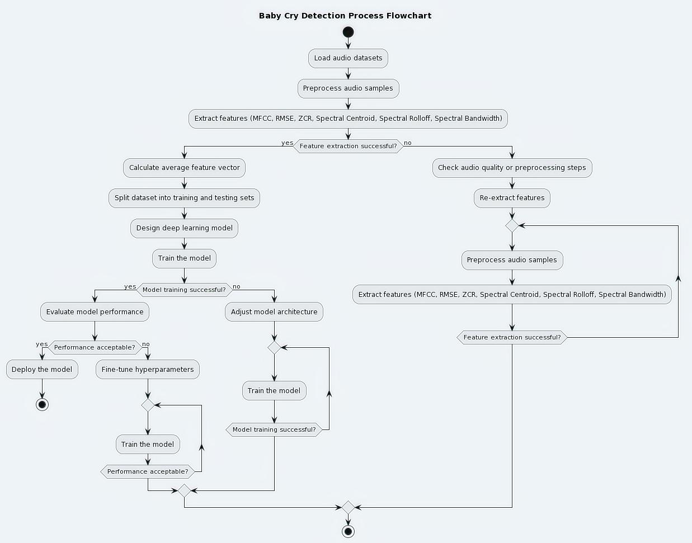

# Audio-Classification
**Baby Cry Classification Using Deep Learning**

This project aims to classify audio recordings to determine whether a baby is crying or not. Using deep learning techniques, the model can effectively identify crying sounds amidst various background noises.

  <h3>Project Overview</h3>

- **Dataset**: Audio samples of baby cries, noise, laugh, and silence.
- **Preprocessing**: Applied noise reduction and normalization to improve audio quality.
- **Feature Extraction**: Utilized Mel-frequency cepstral coefficients (MFCCs) and Zero Crossing Rate, taking the average value to capture essential audio features.
- **Model Architecture**: Implemented a Convolutional Neural Network (CNN) for effective pattern recognition in audio signals.
- **Training**: Trained the model with augmented audio data to enhance robustness and generalization.
- **Evaluation**: Achieved **92.5%** accuracy and F1-score, indicating reliable performance in distinguishing baby cries from other sounds.

  

